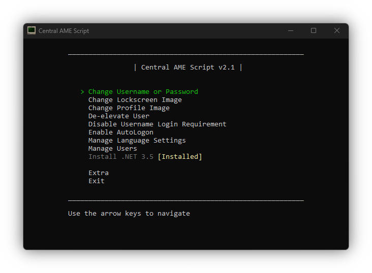

# Central AME Script

Script for automating a large assortment of AME related actions.

## Usage

You can download the script by going to the [latest release](https://git.ameliorated.info/Joe/Central-AME-Script/releases/latest) and downloading `CentralAMEScript.zip` from the Downloads section.

Alternatively, you could clone the repository:

    git clone https://git.ameliorated.info/Joe/Central-AME-Script.git

Once downloaded, you can simply run the script.

## Primary Functions

There are many actions in AME that require commands, the following functions essentially work as an interactive user interface for those.

#### Username/Password

This function allows for changing the user's username or password.

At its core, the following command is used for changing the username:

    wmic useraccount where "name='<currentUsername>'" rename '<newUsername>'

Similarly, the following command is used for changing the password:

    net user "<currentUsername>" "<newPassword>"

#### Lockscreen Image

This function allows for changing the lockscreen image. This is a modified version of [LoganDark's lockscreen-img script](https://git.ameliorated.info/LoganDark/lockscreen-img).

It works by taking ownership of the existing lockscreen image files, and replacing them with the new image supplied by the user.

#### User Elevation

This function allows for elevating the user to administrator. Elevating the user disables the password requirement when trying to run an executable as administrator. However, this has large security implications, thus why it is not the default setting.

At its core, it uses the following command:

    net localgroup administrators "<currentUsername>" /add

#### Display Language

This function allows for changing the user's display language.

Firstly, it prompts the user to download a portion of a ~5.5GB language pack ISO file. Unfortunately, Microsoft no longer publicly distributes individual language pack files, so this is necessary.

Once the ISO is downloaded, it extracts the ISO file, and installs the language pack for the selected display language using the following commands:

    7z e -y -o"<Script Path>\LangPacks" "<Script Path>\LangPacks.ISO" x64\langpacks\*.cab
    lpksetup /i <Language/region ID> /p "<Script Path>\LangPacks\Microsoft-Windows-Client-Language-Pack_x64_<Language/region ID>.cab"

After the language pack is installed, the display language can finally be set. At its core, this is done by using the following commands:

    PowerShell -NoP -C "Set-WinSystemLocale <Language/region ID>"
    PowerShell -NoP -C "Set-WinUserLanguageList <Language/region ID>"

The Language/region ID for a given language can be found [here](https://docs.microsoft.com/en-us/windows-hardware/manufacture/desktop/available-language-packs-for-windows?view=windows-11#language-packs).

The script heavily enchances these simple commands. For instance, it keeps the existing keyboard input method (language), and let's the user decide whether or not to make the new language the default keyboard input method.

#### Keyboard Language

This function allows for adding a keyboard language.

At its core, this is done by using the following command:

    PowerShell -NoP -C "$NewLangs=Get-WinUserLanguageList; $NewLangs[0].InputMethodTips.Add('<Language/region ID>:<Keyboard identifier>'); Set-WinUserLanguageList $NewLangs -Force"

If the user chose to make their selection the new default input method, the following command will also be run:

    PowerShell -NoP -C "Set-WinDefaultInputMethodOverride -InputTip "<Language/region ID>:<Keyboard identifier>""

The Language/region ID and Keyboard identifier for a given language can be found [here](https://docs.microsoft.com/en-us/windows-hardware/manufacture/desktop/available-language-packs-for-windows?view=windows-11#language-packs) amd [here](https://docs.microsoft.com/en-us/windows-hardware/manufacture/desktop/windows-language-pack-default-values?view=windows-11) respecively.

#### Username Login Requirement

This function allows for disabling or enabling the username login requirement.

At its core, it uses the following command:

    reg delete "HKLM\SOFTWARE\Microsoft\Windows\CurrentVersion\Policies\System" /v dontdisplaylastusername /f

Or the following for enabling the requirement:

    reg add "HKLM\SOFTWARE\Microsoft\Windows\CurrentVersion\Policies\System" /v dontdisplaylastusername /t REG_DWORD /d 1 /f

## Extra Functions

Currently this section only contains legacy functions, these are only useful for versions of AME predating the [REDACTED].

#### Windows Script Host

This function allows for enabling or disabling Windows Script Host (WSH). WSH is necessary for some programs.

At its core, the following commands are used:

    reg add "HKEY_USERS\<userSID>\SOFTWARE\Microsoft\Windows Script Host\Settings" /v Enabled /t REG_DWORD /d 1 /f
    reg add "HKLM\SOFTWARE\Microsoft\Windows Script Host\Settings" /v Enabled /t REG_DWORD /d 1 /f

Or the following for disabling WSH:

    reg add "HKEY_USERS\<userSID>\SOFTWARE\Microsoft\Windows Script Host\Settings" /v Enabled /t REG_DWORD /d 0 /f
    reg add "HKLM\SOFTWARE\Microsoft\Windows Script Host\Settings" /v Enabled /t REG_DWORD /d 0 /f

#### NCSI Active Probing

This function allows for enabling or disabling NCSI Active Probing. Some applications require this to be enabled.

At its core, it uses the following command:

    reg add "HKLM\SYSTEM\CurrentControlSet\Services\NlaSvc\Parameters\Internet" /v EnableActiveProbing /t REG_DWORD /d 1 /f

Or the following for disabling NCSI Active Probing:

    reg add "HKLM\SYSTEM\CurrentControlSet\Services\NlaSvc\Parameters\Internet" /v EnableActiveProbing /t REG_DWORD /d 0 /f

## Known Issues

Some keyboard languages may not work, and a few are improperly tagged. This will be fixed in a future release.